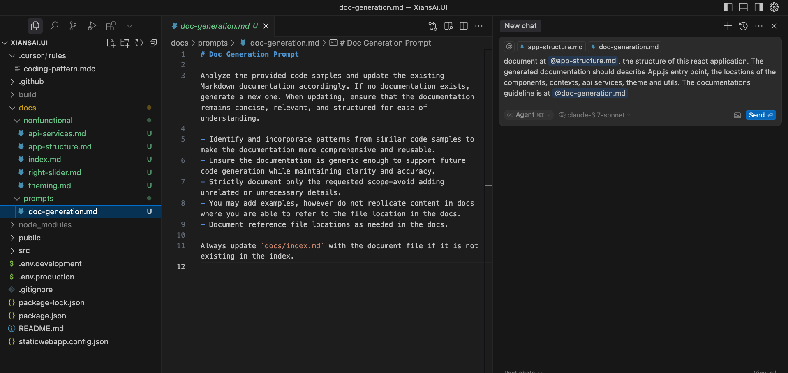
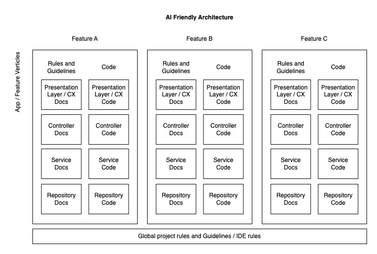

# Documentation creation

## Introduction

go-vibe process recommends that all documentation related to the architecture and design of the code is kept in the repository documentation as markdown files. This way you are able to:

- use AI tools to help you create the documentation
- keep the documentation up to date as the code evolves
- have a single source of truth for the documentation for humans and AI tools

## Markdown docs generation

At this step, we use existing code artefact to generate the documentation. You are able to pass the code samples to the AI tools to create the documentation.

**Greenfield project:**: Even at a new project, it is a common practice to implement a reference architecture by a senior developer or a team. This reference architecture could be used as a starting point for the documentation.

**Brownfield project:**: If you are working on a brownfield project, you can use the existing code artefacts to create the documentation.

## Example prompt

The following image shows an example of a prompt that can be used to generate the documentation.



The prompt is using the [Cursor](https://www.cursor.com/) IDE.

- **Prompt Reuse**: You may see, a common part of the prompt is saved in the `prompts` folder. This is a good practice to keep the prompt organised, reused and easily maintained.

- **Use of Cursor Agent**: The prompt is using a Cursor agent to generate the documentation. This is because the agent is able to use its tools to search the code base, read surrounding code to understand the code and the context.

- **Model**: The prompt is using the `claude-3.7-sonnet` model with `thinking` capability on. This is because the model is able to reason on the task and generate a good documentation.

## Markdown docs structure

As an example, consider a web application project. The markdown docs are structured in the following way:

```text
docs/
├── nonfunctional/
│   ├── client-architecture.md
│   ├── server-api-calls.md
│   └── authentication.md
└── prompts/
    ├── ...md
    └── doc-generation.md
```

**overview.md**: This is an index of all relevant documentation. Having this file make it easier to pass all documentation to the AI tools to generate code.

Markdown docs can be organized per feature as well as per verticle layers within the feature as per diagram below.

