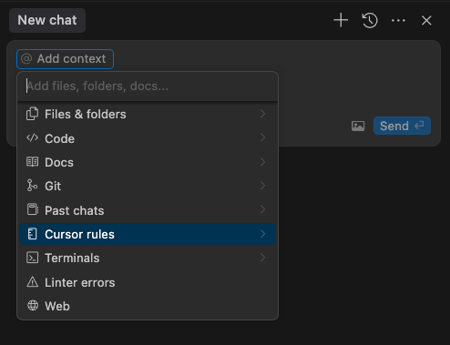

# IDE Rules

## Introduction

Most modern IDEs allow you to define your own custom rules. These rules can be used to format your code, style your code, and even enforce architectural constraints. In this section we will take a look at how Cursor IDE rules work and how to use them to your advantage.

## IDE rules vs. docs in repo

**Markdown docs:** Keep all documentation related to the architecture and design of the code in the repository documentation as markdown files. See [docs/doc-creation.md](./docs/doc-creation.md) for more information.

**IDE rules:** Code generation rules are best kept in the IDE rules file as shown below. However the design and architecture of the code should be documented in the markdown docs instead of using the IDE rules files.

## Cursor IDE Rules

Cursor IDE rules are a way to customize the behavior of the Cursor IDE. They are defined in  `.mdc` files inside the `.cursor/rules` folder on the root of the repository.



Above image shows the new IDE rule addition in Cursor.

## Cursor IDE Example Rules File

E.g., `.cursor/rules/coding-patterns.mdc`:

```markdown
# Coding patterns

## Style of coding

- Always prefer simple, readable code over compact, dense code.
- Avoid duplicating code, meaning search for existing code that can be reused instead of creating new code that is similar.
- Try to use already existing design and architecture patterns instead of inventing your own.
- Use meaningful variable and function names.
- Keep functions small and focused, ideally less than 50 lines of code.
- Keep classes and modules small and focused, ideally less than 300 lines of code. If larger, try to split them into smaller classes or modules.

## Error handling

- Always handle errors and edge cases.
- If an error is not handled, it should at least be logged.

    
```

You can set the rule attached to every chat and command+k request.
